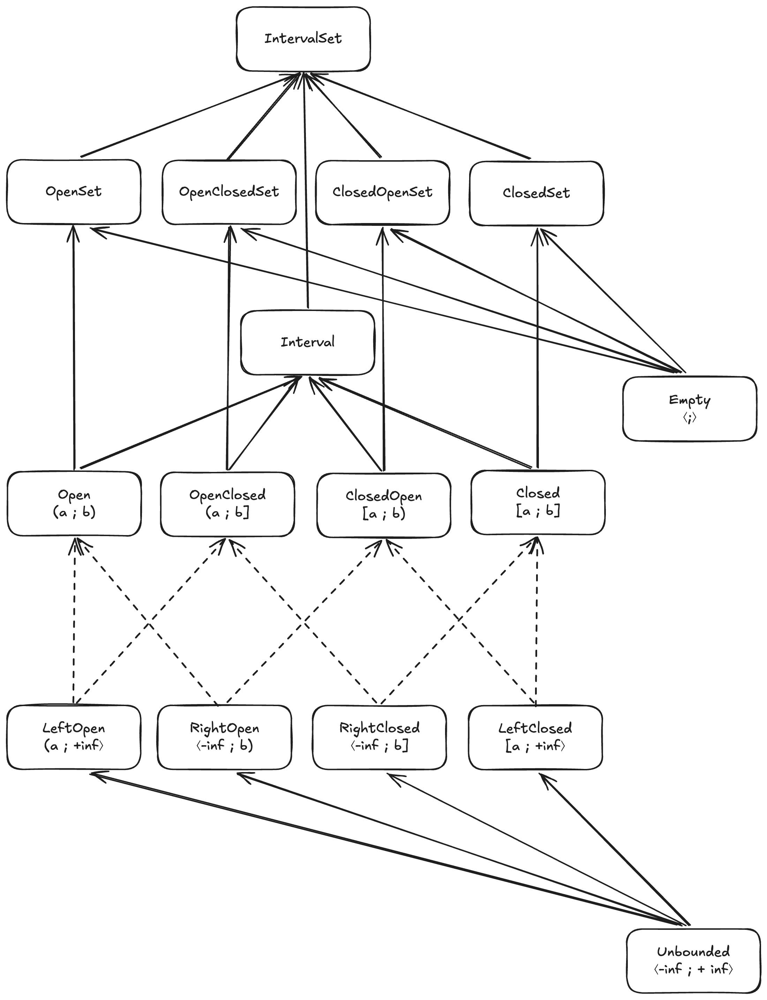

# Class hierarchy

The following diagram offers an overview of the different classes and their inheritance relationships.

 Solid arrows mean `Subclass[T]` inherits from `Superclass[T]`  
 Dashed arrows mean `Subclass[T]` inherits from `Superclass[T | None]`

## IntervalSet

Any `IntervalSet` is a disjoint union of zero or more atomic intervals.
It supports iteration and slicing over its atomic intervals and supports all set-operations, like union, intersection and many others.
`IntervalSet` places no constraints on the mix of interval types it consists of and its atomic intervals are always simplified and sorted.
What's more, the type of the created object is automatically normalized as explained below.

## Creating interval objects

When using `IntervalSet` to instantiate a new interval set object, the actual object created might not be of the type `IntervalSet`.
Instead, an object of a subclass of `IntervalSet` could be created.

- When creating an `IntervalSet` of zero atomic intervals an instance of type `Empty` will be created
- When creating an `IntervalSet` of one atomic interval an instance of a subtype of `Interval` will be created
- When creating an `IntervalSet` of multiple atomic intervals of the same type an `OpenSet`, `ClosedSet`, `OpenClosedSet` or `CloseOpenSet` will be created, depending on the type of the atomic intervals
- Only when creating an `IntervalSet` of multiple atomic intervals of mixed type a `IntervalSet` will be created.
  There are exception to this rule. 
  Certain combinations of atomic interval types can unite to a more specific type of `IntervalSet`. Some examples:
    - `IntervalSet([RightOpen(3), ClosedOpen(5, 8), LeftClosed(10)])` will result in a `ClosedOpenSet` instance (all atomic intervals inherit from `CloseOpen`)  
    - `IntervalSet([RightOpen(3), LeftClosed(10)])` will result in a `ClosedOpenSet` instance as well
    - `IntervalSet([RightOpen(3), Closed(10, 20)])` is not compatible with any subtype and will result in an `IntervalSet`

All `beset` interval classes show this behavior consistently.
For instance, `Open(3, None)` will result in `LeftOpen(3)` instead of an instance of the `Open` interval class.
This automatic type normalization behaves in such a way as to uphold these guarantees:

- Each interval or interval set can and will be represented by exactly one type
- When using an interval class to create an interval or interval set object the resulting object will always have a type that is a subclass of the class used to create it

## OpenSet, ClosedSet, OpenClosedSet, ClosedOpenSet

These classes are restricted versions of `IntervalSet` and behave in the same way, except that they only allow atomic intervals of their associated type or their subtypes.
For example, a `ClosedOpenSet` may contain `ClosedOpen` intervals or any of its subtypes: `RightOpen`, `LeftClosed` and `Unbounded`.
Those unbounded subtypes are only allowed if the type argument of the `IntervalSet` is an optional type (a union with `None`).
If not, only the matching bounded atomic interval type is allowed; `ClosedOpen` in the case of `ClosedOpenSet`.

## Empty

This class represents any `IntervalSet` with zero atomic intervals or any empty `Interval`. No value is contained by this interval.
It is not a generic and has no type because it has no bounds.
It inherits from all `IntervalSet` types, regardless of their type argument.
It is not considered atomic, since its interval count is zero and it does not implement the `start` or `stop` properties.

## Interval

This is the abstract base class for all atomic intervals.
It can be used to instantiate an atomic interval of one of its subtypes.
For example `Interval(5, 9, left_closed=True, right_closed=False)` will result in `ClosedOpen(5, 9)`.

All objects of the `Interval` type feature the read-only `start` and `stop` properties, which expose their bounds.

`Interval` objects are also `IntervalSet` objects and support iteration, slicing and all operations allowed for multiintervals.
However, they have always exactly one subinterval which is itself, much like single character strings in Python.

## Open, Closed, OpenClosed, ClosedOpen

These four concrete atomic intervals are the basic building blocks of the `beset` interval library.
They contains all values between their bounds,
but differ in behavior with regards to whether the bounds themselves are considered members of the interval.

| type | representation | contains `x` iff | 
| --- | :-: | :-: |
| `Open(a, b)` | `(a ; b)` | `a < x < b` |
| `Closed(a, b)` | `[a : b]` | `a <= x <= b` | 
| `OpenClosed(a, b)` | `(a ; b]` | `a < x <= b` | 
| `ClosedOpen(a, b)` | `[a : b)` | `a <= x < b` |

These classes can be used to create object of their own type or of an unbounded subtype.
For example, `Open(1, 2)` creates an object of type `Open`,
but `Open(1, None)`, `Open(None, 2)` and `Open(None, None)` create objects of types `LeftOpen`, `RightOpen` and `Unbounded`, respectively. 

## LeftOpen, RightOpen, LeftClosed, RightClosed 

These classes represent semibounded intervals.
They have a lower bound or an upper bound but not both and contain all values to one side of their bound.

| type | representation | contains `x` iff | 
| --- | :-: | :-: |
| `LeftOpen(a)` | `(a ; +inf⟩` | `x > a` |
| `RightOpen(b)` | `⟨-inf : b)` | `x < b` | 
| `LeftClosed(a)` | `[a ; +inf⟩` | `x >= a` | 
| `RightClosed(b)` | `⟨-inf : b]` | `x <= b` |

Note that semibounded intervals introduce `None` into the intervals' type argument, since either their `start` or `stop` property returns `None`.
`LeftOpen[T]` inherits from `Open[T | None]` and from `OpenClosed[T | None]` and `LeftOpen` cannot be substituted where `OpenClosed[T]` is expected and `T` is not optional.
The same goes for the other unbounded intervals.

## Unbounded

The unbounded interval has no bounds and contains everything.
Having no bounds means it has no type argument and is not a generic type.
It can be substituted for semibounded intervals, but not for bounded intervals unless the bound type is optional.

The unbounded interval object contains all values.
